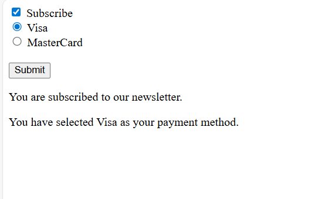

# A simple program to demonstrate the checked property
A simple program is created showing the usage of checkbox and radio button inputs.
When a user selects a checkbox we display a text content saying the user is subscribed and on selecting a radio button a
corresponding text is displayed.

# Output Screenshots:
